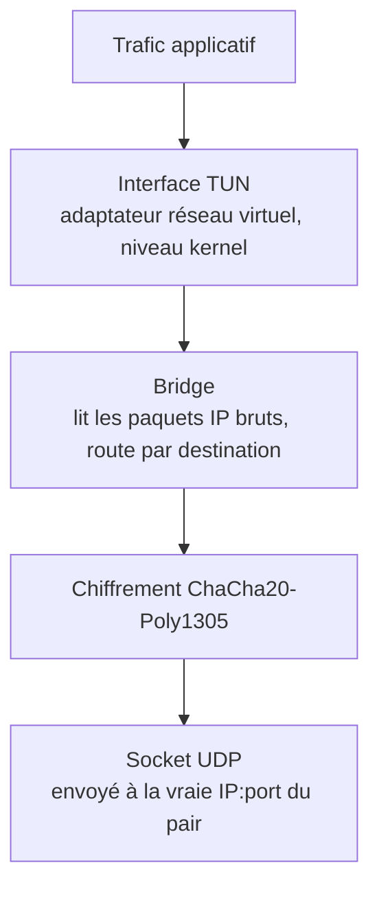

# MyVPN

Un VPN construit de zéro en Python qui implémente le protocole WireGuard.
WireGuard définit les primitives cryptographiques, la conception du handshake
et le format des paquets utilisés par les VPN modernes. Ce projet réimplémente
ce protocole pour comprendre son fonctionnement interne — pas une surcouche
autour du vrai WireGuard, mais une implémentation Python du même protocole
écrite à la main.

Construit avec Python 3.12 et la bibliothèque `cryptography`. Fonctionne sur
Linux et macOS.

---

## Ce que fait réellement un VPN

Quand vous vous connectez à un VPN, votre OS envoie des paquets IP dans une
interface réseau virtuelle (TUN). Le daemon VPN lit ces paquets, les chiffre,
et les transmet en UDP au pair distant. Le pair les déchiffre, les écrit dans
sa propre interface TUN, et les paquets continuent vers leur destination comme
si les deux machines étaient sur le même réseau.

MyVPN implémente chaque étape de cette chaîne.



Le chemin inverse (paquets entrants) s'exécute dans un thread parallèle.

---

## Cryptographie

### Clés

Chaque pair possède une paire de clés **X25519** long terme. X25519 est une
fonction Diffie-Hellman sur courbe elliptique : chaque partie détient un scalaire
privé et un point public, et peut calculer indépendamment le même secret partagé
sans jamais le transmettre.

### Handshake — Noise IK

Avant que la moindre donnée circule, les deux pairs exécutent un handshake
**Noise IK**. « IK » signifie que l'initiateur connaît à l'avance la clé
statique publique du répondeur. Le handshake effectue quatre opérations
Diffie-Hellman et les mélange dans une clé de chaînage via BLAKE2s + HMAC-KDF :

| Étape | Opération DH | Rôle |
|---|---|---|
| DH1 | éphémère_i × statique_r | lie l'éphémère de l'initiateur à l'identité du répondeur |
| DH2 | statique_i × statique_r | authentification mutuelle statique |
| DH3 | éphémère_i × éphémère_r | confidentialité persistante |
| DH4 | statique_i × éphémère_r | lie l'éphémère du répondeur à l'identité de l'initiateur |

```python
# Chaque résultat DH est intégré à la clé de chaînage via HKDF.
dh1 = initiator_ephemeral_private.exchange(peer_static_public)
chaining_key = handshake.mix_key(chaining_key, dh1)
# ... trois tours supplémentaires ...

# Dérivation finale : initiateur et répondeur dérivent des clés opposées.
receiving_key, temp = handshake.kdf(chaining_key, b"")
sending_key, _      = handshake.kdf(temp, b"")
```

À la fin, les deux pairs possèdent une `sending_key` et une `receiving_key` —
dérivées indépendamment, jamais transmises. Cela assure la **confidentialité
persistante** : même si les clés long terme sont compromises, les sessions
passées restent protégées car les clés éphémères ont disparu.

### Chiffrement des données — ChaCha20-Poly1305

Chaque paquet IP est chiffré avec **ChaCha20-Poly1305** (AEAD). Le nonce est
dérivé d'un compteur monotone par session, donc aucun nonce n'est jamais
réutilisé. Poly1305 assure l'authentification — un paquet falsifié ou rejoué
échoue au déchiffrement et est silencieusement ignoré.

```python
nonce = b'\x00' * 4 + struct.pack('!Q', counter)
ciphertext = ChaCha20Poly1305(sending_key).encrypt(nonce, ip_packet, aad=None)
```

---

## Format des paquets

Chaque datagramme UDP commence par un champ type de 4 octets. MyVPN utilise
quatre types de messages :

| Type | Valeur | Contenu |
|---|---|---|
| Handshake Initiation | 1 | index expéditeur, clé publique éphémère, clé statique chiffrée |
| Handshake Response | 2 | index expéditeur, index récepteur, clé éphémère du répondeur |
| Transport Data | 4 | index récepteur, compteur (8 octets), paquet IP chiffré |
| Keep-Alive | 5 | index récepteur, compteur (sans payload) |

Le compteur dans les paquets de transport alimente aussi une **fenêtre glissante**
(taille 2000) qui rejette les paquets dupliqués ou rejoués sans bloquer la
livraison dans le désordre.

---

## Interface TUN

Un périphérique TUN est un adaptateur réseau virtuel géré par le kernel. L'ouvrir
donne au daemon un descripteur de fichier pour lire et écrire des paquets IP bruts
— l'OS y route le trafic, et ce que le daemon y écrit en retour ressort comme du
trafic réseau reçu.

MyVPN implémente TUN sur les deux plateformes derrière une classe abstraite
`BaseTun` commune :

**Linux** — ouvre `/dev/net/tun` et émet `TUNSETIFF` via `ioctl`.

**macOS** — se connecte au contrôleur kernel `com.apple.net.utun_control` via
un socket `PF_SYSTEM`. Le kernel assigne automatiquement un numéro `utunN`.
macOS préfixe chaque paquet d'un en-tête de famille d'adresses de 4 octets,
que l'implémentation retire à la lecture et rajoute à l'écriture.

```python
# macOS : retirer l'en-tête AF de 4 octets à chaque lecture.
data = self._socket.recv(self.mtu + 4)
packet = data[4:]  # paquet IP brut
```

---

## Bridge — la boucle centrale

`Bridge` est le cœur du daemon. Il fait tourner quatre threads en parallèle :

| Thread | Rôle |
|---|---|
| **TUN→UDP** | Lire un paquet IP depuis TUN, trouver le pair par IP de destination, chiffrer, envoyer en UDP |
| **UDP→TUN** | Recevoir un datagramme UDP, dispatcher par type (handshake ou données), déchiffrer, écrire dans TUN |
| **Rekey** | Vérifier toutes les 10 s les sessions expirées et réinitier le handshake |
| **Cleanup** | Purger les handshakes en attente périmés toutes les 30 s |

Si la boucle TUN→UDP détecte un paquet pour un pair sans session active, elle
déclenche un handshake automatiquement — limité à une tentative par pair toutes
les 5 secondes pour éviter le flooding.

Le roaming d'endpoint est supporté : si un paquet de données arrive d'une IP ou
d'un port différent de celui enregistré, l'endpoint de la session est mis à jour
en place.

---

## Serveur — routage des paquets

Le serveur peut servir plusieurs clients simultanément. Quand un paquet chiffré
arrive en UDP, le serveur doit rapidement répondre à deux questions : *qui a
envoyé ceci ?* et *où doit aller le paquet IP déchiffré ?* Ces lookups se
produisant sur chaque paquet dans le chemin critique, `PeerManager` maintient
trois tables de lookup pré-construites, mises à jour une seule fois à
l'enregistrement du pair.

### Trois tables de lookup

| Clé | Dictionnaire | Rôle |
|---|---|---|
| `peer_id` | `peers` | config complète + clé publique + IPs autorisées |
| `ip_str` | `ip_to_peer` | routage — IP destination → pair |
| `key_bytes` | `pubkey_to_peer` | handshake — qui frappe ? |

`ip_to_peer` est la table de routage. Quand un paquet arrive de l'interface TUN
et doit être transmis à un client, le bridge extrait l'IP de destination et
interroge ce dict en O(1) au lieu de parcourir la liste des IPs autorisées de
chaque pair.

### Expansion des routes par paliers à l'enregistrement

Peupler `ip_to_peer` efficacement dépend de la taille de la plage d'IPs assignée
au pair. `add_peer` gère trois cas :

```python
if network.num_addresses == 1:          # /32 — hôte unique
    ip_to_peer[str(network.network_address)] = peer_id

elif network.prefixlen >= 24:           # /24 ou plus petit — énumérer tous les hôtes
    for ip in network.hosts():
        ip_to_peer[str(ip)] = peer_id

else:                                   # grand réseau — différer au moment de l'exécution
    ip_to_peer[f"_network_{allowed_ip}"] = peer_id
```

La plupart des clients reçoivent un `/32` — une IP, une entrée dict, lookup
instantané. Un `/24` (256 adresses) est entièrement énuméré à l'enregistrement
pour que les lookups restent O(1). Pour les grands réseaux, l'entrée est un
sentinelle et `find_peer_by_ip` bascule sur un scan linéaire.

### Lookup IP en deux passes

`find_peer_by_ip` tente d'abord le chemin rapide, puis bascule :

```python
def find_peer_by_ip(self, ip_address: str) -> Optional[str]:
    # Chemin rapide : correspondance exacte dans le dict pré-construit.
    peer_id = self.ip_to_peer.get(ip_address)
    if peer_id:
        return peer_id

    # Chemin lent : scan linéaire pour les pairs avec de grands réseaux.
    ip = ipaddress.ip_address(ip_address)
    for peer_id, config in self.peers.items():
        for allowed_ip in config.allowed_ips:
            if ip in ipaddress.ip_network(allowed_ip):
                return peer_id

    return None
```

### Identification lors du handshake

Les paquets de handshake entrants ne portent pas encore d'index de session — le
serveur doit identifier l'initiateur uniquement à partir de son identité
cryptographique. L'initiateur chiffre sa clé publique statique avec la clé
publique du serveur ; le serveur la déchiffre et cherche le résultat dans
`pubkey_to_peer`. Si la clé n'est pas enregistrée, le handshake est silencieusement
ignoré.

### Routage par index de session

Une fois la session établie, chaque paquet de données porte un `receiver_index` —
un entier aléatoire sur 32 bits choisi par le créateur de la session.
`SessionManager` maintient un dict `index_to_peer` qui mappe ces entiers
directement aux IDs de pairs. Les paquets de données entrants frappent ce lookup
en premier ; si l'index est inconnu, le paquet est ignoré sans toucher à la liste
des pairs.

---

## CLI

Gérer un daemon VPN à la main — clés, fichiers de configuration, processus en
arrière-plan — est fastidieux et source d'erreurs. Un CLI dédié enveloppe tout
cela en commandes simples. Les modules `server` et `client` exposent la même
structure :

```bash
# Gestion des clés
sudo python -m my_vpn.server genkey --save
sudo python -m my_vpn.server pubkey private.key --save

# Configuration
sudo python -m my_vpn.server config init
sudo python -m my_vpn.server config set Interface.Address 10.0.0.1/24
sudo python -m my_vpn.server config set Interface.ListenPort 51820

# Gestion des pairs
sudo python -m my_vpn.server peer add <CLIENT_PUBKEY> --allowed-ips 10.0.0.2/32

# Cycle de vie du daemon
sudo python -m my_vpn.server start   # lance le processus en arrière-plan, écrit le fichier PID
sudo python -m my_vpn.server status  # affiche les sessions actives
sudo python -m my_vpn.server status --follow  # suit les logs en temps réel
sudo python -m my_vpn.server stop
```

Le daemon tourne en arrière-plan, suivi par un fichier PID. `stop` envoie
`SIGTERM`, escaladant vers `SIGKILL` si le processus ne s'arrête pas proprement.

---

## Source

[github.com/AlexandreVig/MyVPN](https://github.com/AlexandreVig/MyVPN)
