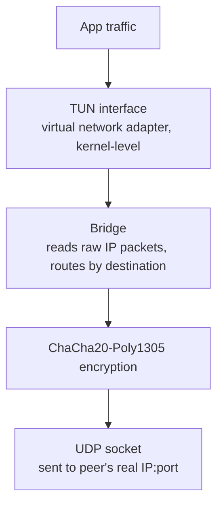

# MyVPN

A VPN built from scratch in Python that implements the WireGuard protocol.
WireGuard defines the cryptographic primitives, the handshake design,
and the packet format used by modern VPNs. This project reimplements
this protocol to understand its inner workings—not an overlay
around the actual WireGuard, but a hand-coded Python implementation
of the protocol itself.

Built with Python 3.12 and the `cryptography` library. Runs on Linux and macOS.

---

## What a VPN actually does

When you connect to a VPN, your OS sends IP packets into a virtual network
interface (TUN). The VPN daemon reads those packets, encrypts them, and forwards
them over UDP to the remote peer. The peer decrypts them, writes them into its
own TUN interface, and the packets continue to their destination as if the two
machines were on the same network.

MyVPN implements every step of that pipeline.



The reverse path (incoming packets) runs in a parallel thread.

---

## Cryptography

### Keys

Each peer has a long-term **X25519** key pair. X25519 is an elliptic-curve
Diffie-Hellman function: two parties each hold a private scalar and a public
point, and they can independently compute the same shared secret without ever
transmitting it.

### Handshake — Noise IK

Before any data flows, the two peers run a **Noise IK** handshake. "IK" means
the initiator knows the responder's static public key in advance. The handshake
performs four Diffie-Hellman operations and mixes them into a running chaining
key using BLAKE2s + HMAC-KDF:

| Step | DH operation | Purpose |
|---|---|---|
| DH1 | ephemeral_i × static_r | bind initiator's ephemeral to responder's identity |
| DH2 | static_i × static_r | mutual static authentication |
| DH3 | ephemeral_i × ephemeral_r | forward secrecy |
| DH4 | static_i × ephemeral_r | bind responder's ephemeral to initiator's identity |

```python
# Each DH result is folded into the chaining key with HKDF.
dh1 = initiator_ephemeral_private.exchange(peer_static_public)
chaining_key = handshake.mix_key(chaining_key, dh1)
# ... three more rounds ...

# Final key derivation: initiator and responder derive opposite keys.
receiving_key, temp = handshake.kdf(chaining_key, b"")
sending_key, _      = handshake.kdf(temp, b"")
```

At the end both peers hold a `sending_key` and a `receiving_key` — derived
independently, never transmitted. This gives **perfect forward secrecy**: if
the long-term keys are ever compromised, past sessions remain protected because
the ephemeral keys are gone.

### Data encryption — ChaCha20-Poly1305

Every IP packet is encrypted with **ChaCha20-Poly1305** (AEAD). The nonce is
derived from a monotonic per-session counter, so no nonce is ever reused.
Poly1305 provides authentication — a tampered or replayed packet fails
decryption and is silently dropped.

```python
nonce = b'\x00' * 4 + struct.pack('!Q', counter)
ciphertext = ChaCha20Poly1305(sending_key).encrypt(nonce, ip_packet, aad=None)
```

---

## Packet format

Each UDP datagram starts with a 4-byte type field. MyVPN uses four message types
that mirror WireGuard's wire format:

| Type | Value | Content |
|---|---|---|
| Handshake Initiation | 1 | sender index, ephemeral pubkey, encrypted static pubkey |
| Handshake Response | 2 | sender index, receiver index, responder ephemeral pubkey |
| Transport Data | 4 | receiver index, counter (8 bytes), encrypted IP packet |
| Keep-Alive | 5 | receiver index, counter (no payload) |

The counter in transport packets also feeds a **sliding window** (size 2000)
that rejects duplicate or replayed packets without blocking out-of-order delivery.

---

## TUN interface

A TUN device is a virtual network adapter managed by the kernel. Opening it
gives the daemon a file descriptor to read and write raw IP packets — the OS
routes traffic into it, and whatever the daemon writes back comes out the other
side as received network traffic.

MyVPN implements TUN for both platforms behind a common `BaseTun` abstract class:

**Linux** — opens `/dev/net/tun` and issues `TUNSETIFF` via `ioctl`.

**macOS** — connects to the kernel's `com.apple.net.utun_control` via a
`PF_SYSTEM` socket. The kernel auto-assigns a `utunN` interface number.
macOS prepends a 4-byte address-family header to every packet, which the
implementation strips on read and prepends on write.

```python
# macOS: strip the 4-byte AF header on every read.
data = self._socket.recv(self.mtu + 4)
packet = data[4:]  # raw IP packet
```

---

## Bridge — the central loop

`Bridge` is the daemon's core. It runs four threads simultaneously:

| Thread | What it does |
|---|---|
| **TUN→UDP** | Read IP packet from TUN, look up peer by destination IP, encrypt, send via UDP |
| **UDP→TUN** | Receive UDP datagram, dispatch by message type (handshake or data), decrypt, write to TUN |
| **Rekey** | Check every 10 s for expired sessions and re-initiate the handshake |
| **Cleanup** | Purge stale pending-handshake entries every 30 s |

If the TUN→UDP loop sees a packet for a peer with no active session, it triggers
a handshake automatically — rate-limited to one attempt per peer every 5 seconds
to prevent flooding.

Endpoint roaming is supported: if a data packet arrives from a different IP or
port than the one on record, the session's endpoint is updated in place. This
mirrors WireGuard's own roaming behaviour.

---

## Server — packet routing

The server can serve multiple clients simultaneously. When an encrypted packet
arrives over UDP, the server has to quickly answer two questions: *who sent
this?* and *where should the decrypted IP packet go?* These lookups happen on
every single packet in the hot path, so `PeerManager` maintains three
pre-built lookup tables that are updated once at peer registration time.

### Three lookup tables

| Key | Dictionary | Purpose |
|---|---|---|
| `peer_id` | `peers` | full config + public key + allowed IPs |
| `ip_str` | `ip_to_peer` | routing — destination IP → peer |
| `key_bytes` | `pubkey_to_peer` | handshake — who is knocking? |

`ip_to_peer` is the routing table. When a packet arrives from the TUN interface
and needs to be forwarded to a client, the bridge extracts the destination IP
and hits this dict for an O(1) lookup instead of scanning every peer's
allowed-IP list on every packet.

### Tiered route expansion on peer registration

Populating `ip_to_peer` efficiently depends on the size of the allowed-IP range
the peer is assigned. `add_peer` handles three cases:

```python
if network.num_addresses == 1:          # /32 — single host
    ip_to_peer[str(network.network_address)] = peer_id

elif network.prefixlen >= 24:           # /24 or smaller — enumerate all hosts
    for ip in network.hosts():
        ip_to_peer[str(ip)] = peer_id

else:                                   # large network — defer to runtime matching
    ip_to_peer[f"_network_{allowed_ip}"] = peer_id
```

Most clients get a `/32` — one IP, one dict entry, instant lookup. A `/24`
(256 addresses) gets fully enumerated at registration so runtime lookups remain
O(1). For larger networks the entry is a sentinel, and `find_peer_by_ip` falls
back to a linear scan at runtime.

### Two-pass IP lookup

`find_peer_by_ip` first tries the fast path, then falls back:

```python
def find_peer_by_ip(self, ip_address: str) -> Optional[str]:
    # Fast path: exact match in the pre-built dict.
    peer_id = self.ip_to_peer.get(ip_address)
    if peer_id:
        return peer_id

    # Slow path: linear scan for large-network peers.
    ip = ipaddress.ip_address(ip_address)
    for peer_id, config in self.peers.items():
        for allowed_ip in config.allowed_ips:
            if ip in ipaddress.ip_network(allowed_ip):
                return peer_id

    return None
```

### Handshake identification

Incoming handshake packets carry no session index yet — the server has to
figure out who is initiating purely from the cryptographic identity. The
initiator encrypts its static public key using the server's public key, so the
server decrypts it and looks up the result in `pubkey_to_peer`. If the key
isn't registered, the handshake is silently dropped.

### Session index routing

Once a session is established, every data packet carries a `receiver_index` — a
random 32-bit integer chosen by the session creator. `SessionManager` keeps a
`index_to_peer` dict that maps these integers directly to peer IDs. Incoming
data packets hit this lookup first; if the index is unknown the packet is
dropped without touching the peer list.

---

## CLI

Running a VPN daemon by hand — managing keys, config files, and background
processes — is error-prone. A dedicated CLI wraps all of that into simple
commands. Both `server` and `client` modules expose the same structure:

```bash
# Key management
sudo python -m my_vpn.server genkey --save
sudo python -m my_vpn.server pubkey private.key --save

# Configuration
sudo python -m my_vpn.server config init
sudo python -m my_vpn.server config set Interface.Address 10.0.0.1/24
sudo python -m my_vpn.server config set Interface.ListenPort 51820

# Peer management
sudo python -m my_vpn.server peer add <CLIENT_PUBKEY> --allowed-ips 10.0.0.2/32

# Daemon lifecycle
sudo python -m my_vpn.server start   # spawns background process, writes PID file
sudo python -m my_vpn.server status  # show active sessions
sudo python -m my_vpn.server status --follow  # tail logs in real time
sudo python -m my_vpn.server stop
```

The daemon runs as a background process tracked by a PID file. `stop` sends
`SIGTERM`, escalating to `SIGKILL` if the process doesn't exit cleanly.

---

## Source

[github.com/AlexandreVig/MyVPN](https://github.com/AlexandreVig/MyVPN)
